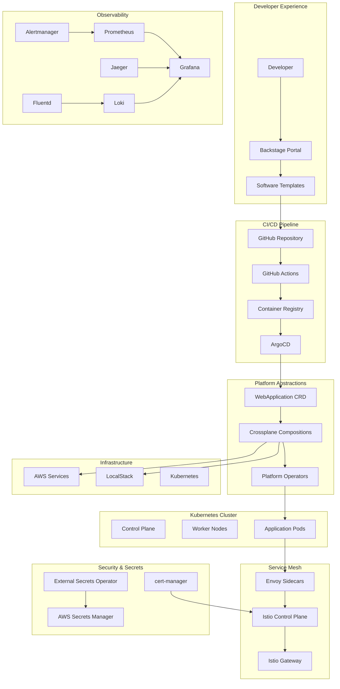
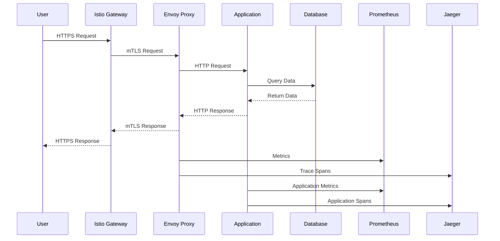
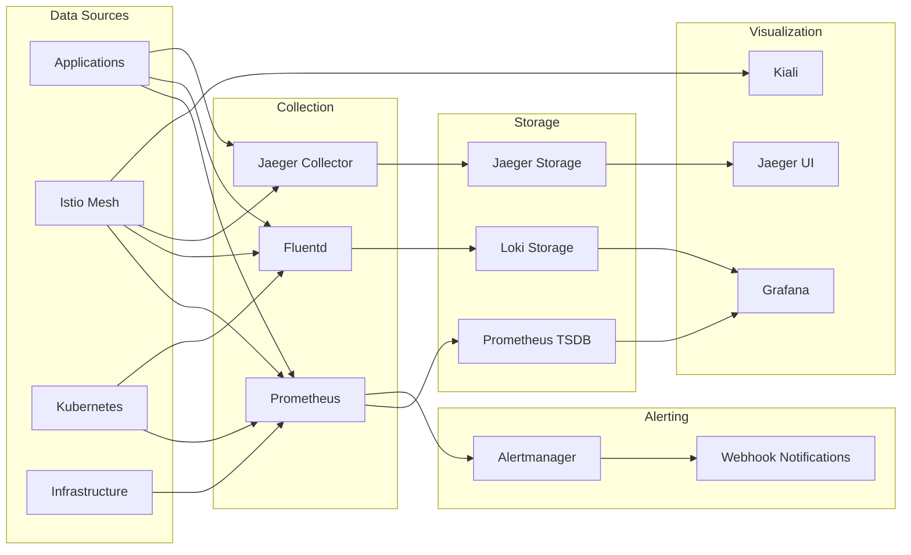
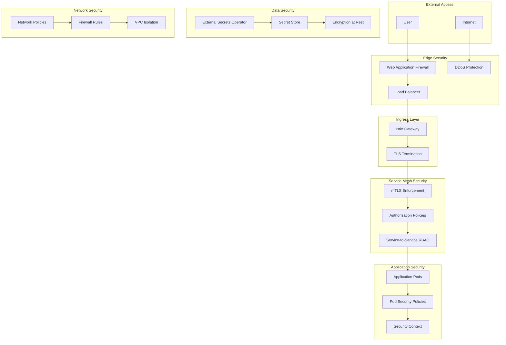
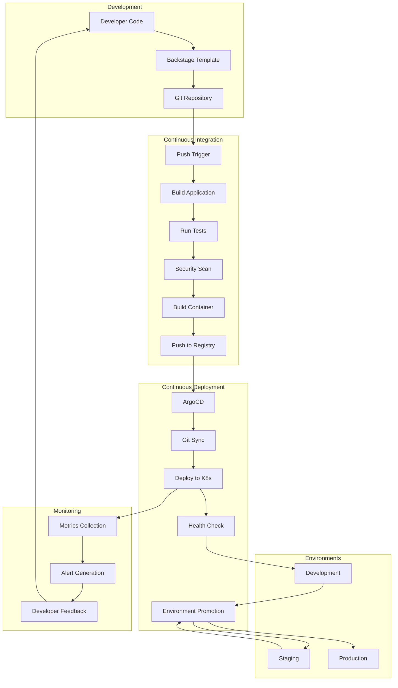
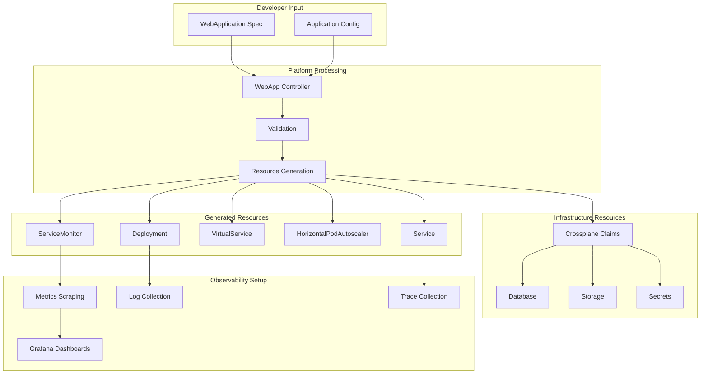
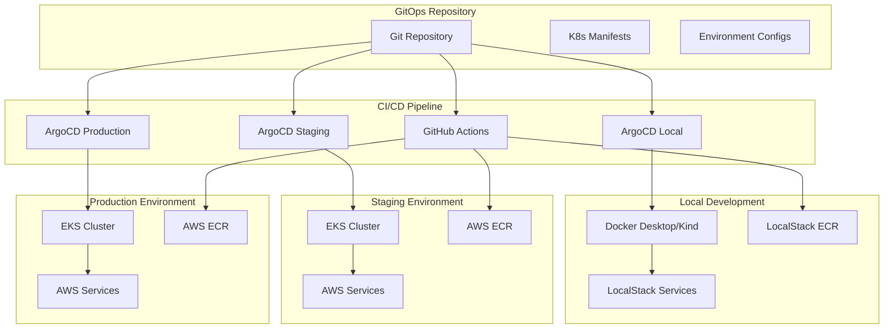
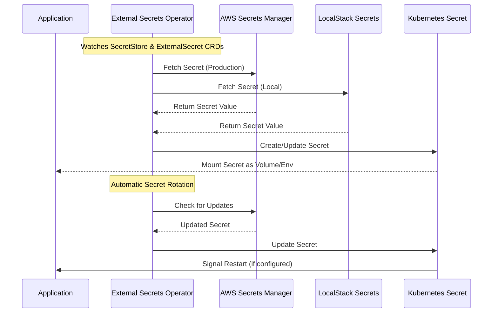
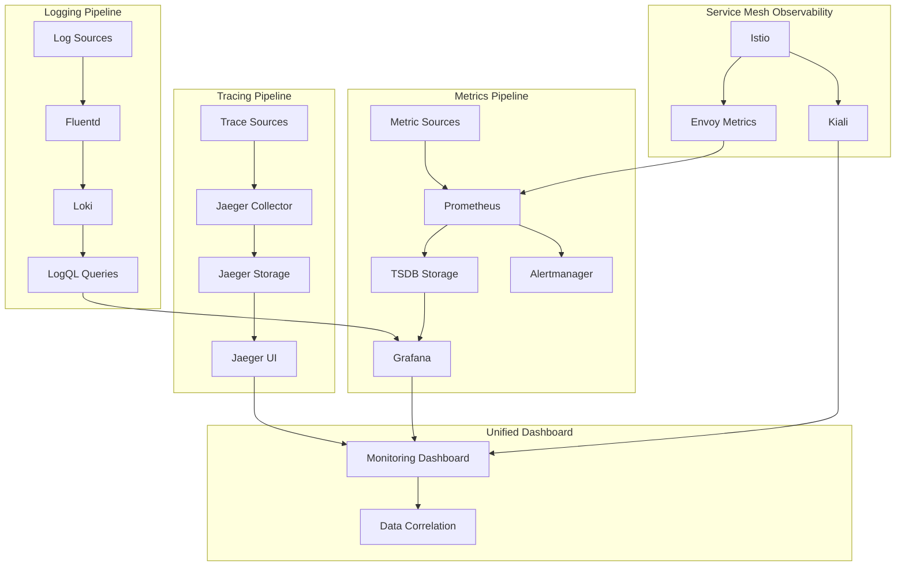

# IDP Platform Component Diagrams

## High-Level Platform Architecture

## Network Flow Diagram

## Data Flow Architecture

## Security Architecture

## CI/CD Pipeline Flow

## WebApplication CRD Workflow

## Multi-Environment Architecture

## Secrets Management Flow

## Observability Stack Integration

