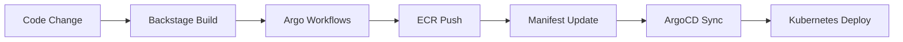

# Container Builds with Argo Workflows - Complete Guide

## 🎯 Overview

The IDP platform now provides **internal CI/CD capabilities** through Argo Workflows, eliminating the need for external CI systems like GitHub Actions for container builds. Engineers can build and push images directly from the platform.

## 🚀 Key Advantages

### ✅ Benefits of Internal CI/CD

1. **Zero External Dependencies**: Everything runs within your Kubernetes cluster
2. **Self-Service**: Engineers trigger builds through Backstage UI
3. **GitOps Native**: Workflows managed as code, versioned in Git
4. **Cost Effective**: No external CI service costs
5. **Secure**: Builds run within your security perimeter
6. **Scalable**: Auto-scales with Kubernetes resources
7. **Integrated**: Direct integration with ECR and ArgoCD

### 🏗️ Architecture Comparison

**Before (External CI)**:
```
GitHub → GitHub Actions → ECR → ArgoCD → Kubernetes
```

**After (Internal CI)**:
```
Engineer → Backstage → Argo Workflows → ECR → ArgoCD → Kubernetes
```

## 📋 Prerequisites

1. **Platform Running**: Start with `./scripts/quick-start.sh`
2. **Access**: Ensure you can access Backstage at http://localhost:3000
3. **Source Code**: Git repository with your application code
4. **Dockerfile**: Container build instructions in your repository

## 🛠️ How to Build Images

### Method 1: Self-Service via Backstage (Recommended)

#### For General Applications

1. **Access Backstage**: http://localhost:3000
2. **Navigate to Create**: Click "Create" in the left sidebar
3. **Select Template**: Choose "Build Docker Image"
4. **Fill Parameters**:
   ```
   Application Name: my-web-app
   Repository URL: https://github.com/your-org/your-app.git
   Branch: main
   Dockerfile Path: Dockerfile
   Build Context: .
   Image Tag: v1.0.0
   Environment: development
   ```
5. **Submit**: Click "Create" to trigger the build
6. **Monitor**: Follow the workflow link to see build progress

#### For Backstage Applications

1. **Access Backstage**: http://localhost:3000
2. **Navigate to Create**: Click "Create" in the left sidebar
3. **Select Template**: Choose "Build Backstage Application"
4. **Fill Parameters**:
   ```
   Application Name: my-backstage-portal
   Repository URL: https://github.com/your-org/backstage-app.git
   Branch: main
   Dockerfile: Dockerfile.prebuilt
   Image Tag: v1.0.0
   Auto Sync: true
   ```
5. **Submit**: Click "Create" to start the build
6. **Auto Deploy**: If Auto Sync is enabled, ArgoCD will deploy after successful build

### Method 2: Direct Workflow Submission

#### Via Argo Workflows UI

1. **Access Workflows**: http://localhost:4000/workflows
2. **Submit New**: Click "Submit New Workflow"
3. **From Template**: Select "From Template"
4. **Choose**: Pick `docker-build-push` or `backstage-app-build`
5. **Parameters**: Fill the workflow parameters
6. **Submit**: Start the workflow

#### Via Argo CLI (Advanced)

1. **Install Argo CLI**:
   ```bash
   # macOS
   brew install argo
   
   # Linux
   curl -sLO https://github.com/argoproj/argo-workflows/releases/download/v3.5.5/argo-linux-amd64.gz
   gunzip argo-linux-amd64.gz && chmod +x argo-linux-amd64
   sudo mv ./argo-linux-amd64 /usr/local/bin/argo
   ```

2. **Configure Access**:
   ```bash
   export ARGO_SERVER=localhost:2746
   export ARGO_NAMESPACE=argo-workflows
   ```

3. **Submit Workflow**:
   ```bash
   # General Docker build
   argo submit --from workflowtemplate/docker-build-push \
     -p repo-url=https://github.com/your-org/your-app.git \
     -p image-name=my-app \
     -p image-tag=v1.0.0
   
   # Backstage application build
   argo submit --from workflowtemplate/backstage-app-build \
     -p repo-url=https://github.com/your-org/backstage-app.git \
     -p app-name=my-backstage-app
   ```

## 📊 Monitoring Your Builds

### Via Argo Workflows UI

1. **Access**: http://localhost:4000/workflows
2. **View All**: See running and completed workflows
3. **Click Workflow**: View detailed logs and progress
4. **Live Updates**: Watch real-time build progress
5. **Resource Usage**: Monitor CPU/memory consumption

### Via Grafana Dashboards

1. **Access Grafana**: http://localhost:3001
2. **Search**: Look for "Argo Workflows" dashboard
3. **Metrics Available**:
   - Build success rates
   - Build duration trends
   - Resource utilization
   - Error rates and patterns

### Via CLI

```bash
# List all workflows
argo list

# Get specific workflow status
argo get <workflow-name>

# Follow workflow logs
argo logs <workflow-name> -f

# Get workflow events
kubectl get events -n argo-workflows --sort-by='.lastTimestamp'
```

## 🔧 Workflow Templates Available

### 1. `docker-build-push`

**Purpose**: Build any Docker application from Git
**Best For**: Web applications, APIs, microservices

**Parameters**:
- `repo-url`: Git repository URL (required)
- `revision`: Branch/tag to build (default: main)
- `image-name`: Docker image name (required)
- `image-tag`: Image tag (default: latest)
- `dockerfile-path`: Dockerfile location (default: Dockerfile)
- `build-context`: Build context path (default: .)

**Example Usage**:
```bash
argo submit --from workflowtemplate/docker-build-push \
  -p repo-url=https://github.com/nginx/nginx.git \
  -p image-name=custom-nginx \
  -p image-tag=v1.0.0 \
  -p dockerfile-path=debian/Dockerfile
```

### 2. `backstage-app-build`

**Purpose**: Build Backstage applications with Node.js compilation
**Best For**: Backstage developer portals, Node.js applications

**Parameters**:
- `repo-url`: Git repository URL (required)
- `revision`: Branch/tag to build (default: main)
- `app-name`: Application name (required)
- `image-tag`: Image tag (default: latest)
- `dockerfile`: Dockerfile to use (default: Dockerfile.prebuilt)

**Build Process**:
1. Clone source code
2. Install Node.js dependencies
3. Build frontend (React/TypeScript)
4. Build backend (Node.js/TypeScript)
5. Create Docker image
6. Push to ECR

## 🎯 Common Use Cases

### Use Case 1: Microservice Application

**Scenario**: You have a Node.js microservice that needs to be containerized

**Steps**:
1. Ensure your repo has a `Dockerfile`
2. Use Backstage "Build Docker Image" template
3. Parameters: 
   - Name: `user-service`
   - Repo: Your microservice repository
   - Tag: `v2.1.0`
4. Monitor build in Workflows UI
5. Verify image in ECR at http://localhost:4566

### Use Case 2: Custom Backstage Portal

**Scenario**: Building a customized Backstage application for your team

**Steps**:
1. Fork/clone Backstage template
2. Customize plugins and configuration
3. Use "Build Backstage Application" template
4. Enable auto-sync for automatic deployment
5. Access deployed app at http://localhost:3000

### Use Case 3: Multi-Service Application

**Scenario**: Application with frontend, backend, and database components

**Steps**:
1. Build each component separately using templates
2. Use different tags for each service:
   - `my-app-frontend:v1.0.0`
   - `my-app-backend:v1.0.0`
   - `my-app-worker:v1.0.0`
3. Update deployment manifests with new tags
4. ArgoCD will deploy the complete application

## 🔐 Security and Best Practices

### Security Features

1. **RBAC**: Workflows run with minimal required permissions
2. **Service Accounts**: Dedicated accounts for different operations
3. **Network Isolation**: Builds run in isolated pods
4. **Secret Management**: ECR credentials managed securely
5. **mTLS**: All traffic encrypted with Istio service mesh

### Best Practices

1. **Image Tagging**: Use semantic versioning (v1.2.3)
2. **Resource Limits**: Always set CPU/memory limits
3. **Multi-stage Builds**: Use multi-stage Dockerfiles for smaller images
4. **Layer Caching**: Order Dockerfile commands for optimal caching
5. **Security Scanning**: Enable image vulnerability scanning
6. **Clean Up**: Remove old unused images regularly

### Example Dockerfile Best Practices

```dockerfile
# Multi-stage build example
FROM node:20-alpine AS builder
WORKDIR /app
COPY package*.json ./
RUN npm ci --only=production

FROM node:20-alpine AS runtime
WORKDIR /app
COPY --from=builder /app/node_modules ./node_modules
COPY . .
EXPOSE 3000
USER node
CMD ["npm", "start"]
```

## 🐛 Troubleshooting

### Common Issues

#### 1. Workflow Stuck in Pending
```bash
# Check pod status
kubectl get pods -n argo-workflows

# Check resource constraints
kubectl describe pod <workflow-pod> -n argo-workflows

# Check node resources
kubectl top nodes
```

**Solutions**:
- Ensure cluster has sufficient CPU/memory
- Check resource requests in workflow template
- Verify node capacity

#### 2. Docker Build Failures
```bash
# Check workflow logs
argo logs <workflow-name> -c docker-build-step

# Check Docker daemon status
kubectl logs <build-pod> -n argo-workflows -c dind
```

**Common Causes**:
- Dockerfile syntax errors
- Missing dependencies
- Network connectivity issues
- Insufficient disk space

#### 3. ECR Push Failures
```bash
# Check ECR connectivity
kubectl exec -it <build-pod> -n argo-workflows -- \
  aws --endpoint-url=http://localstack:4566 ecr describe-repositories

# Check authentication
kubectl get secret -n argo-workflows
```

**Solutions**:
- Verify LocalStack is running
- Check ECR repository exists
- Verify AWS credentials

#### 4. Git Clone Issues
```bash
# Check git access
argo logs <workflow-name> -c checkout-source
```

**Common Causes**:
- Repository URL incorrect
- Branch/tag doesn't exist
- Network connectivity issues
- Private repository access

### Getting Help

1. **Workflow Logs**: `argo logs <workflow-name>`
2. **Pod Events**: `kubectl get events -n argo-workflows`
3. **Resource Usage**: `kubectl top pods -n argo-workflows`
4. **Platform Health**: `./scripts/start-platform.sh health`

## 📈 Performance Optimization

### Build Performance

1. **Parallel Builds**: Use workflow parallelism for multi-component apps
2. **Caching**: Implement effective Docker layer caching
3. **Resource Tuning**: Optimize CPU/memory allocation
4. **Build Context**: Minimize build context size with `.dockerignore`

### Resource Configuration

```yaml
# Optimal resource settings for different workloads
resources:
  # Small applications
  small:
    requests: { memory: "512Mi", cpu: "250m" }
    limits: { memory: "1Gi", cpu: "500m" }
  
  # Medium applications (Backstage, complex frontends)
  medium:
    requests: { memory: "1Gi", cpu: "500m" }
    limits: { memory: "2Gi", cpu: "1" }
  
  # Large applications (complex builds, monorepos)
  large:
    requests: { memory: "2Gi", cpu: "1" }
    limits: { memory: "4Gi", cpu: "2" }
```

## 🔄 Integration with ArgoCD

### Automatic Deployment Flow

1. **Code Change**: Developer pushes code to Git
2. **Trigger Build**: Engineer triggers build via Backstage
3. **Image Build**: Argo Workflows builds and pushes image
4. **Manifest Update**: Deployment manifest updated with new image tag
5. **ArgoCD Sync**: ArgoCD detects change and deploys
6. **Verification**: Health checks confirm successful deployment

### GitOps Workflow



## 🎓 Advanced Topics

### Custom Workflow Templates

Create specialized templates for your use cases:

```yaml
apiVersion: argoproj.io/v1alpha1
kind: WorkflowTemplate
metadata:
  name: custom-build-template
spec:
  # Custom template definition
```

### Multi-Environment Builds

Build for different environments:
- Development: `image:dev-latest`
- Staging: `image:staging-v1.0.0`
- Production: `image:prod-v1.0.0`

### Integration Testing

Add testing steps to workflows:
1. Build image
2. Run unit tests
3. Deploy to test environment
4. Run integration tests
5. Push to ECR if tests pass

## ✅ Next Steps

1. **Try It Out**: Build your first image using Backstage
2. **Monitor**: Check build metrics in Grafana
3. **Customize**: Create templates for your specific needs
4. **Scale**: Configure auto-scaling for high-volume builds
5. **Integrate**: Connect with your deployment pipelines

Happy building! 🚀

---

**Need Help?**
- Platform Team: Contact via Backstage
- Documentation: `/docs/tutorials/`
- Issues: Check Grafana alerts and logs