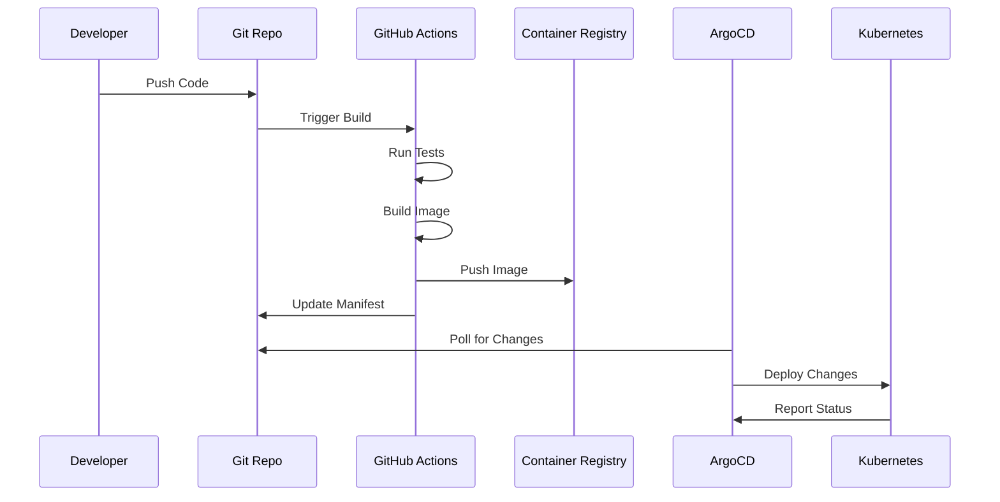

# IDP Platform Getting Started Guide

## Welcome to the IDP Platform! 🚀

This guide will help you get started with the Integrated Developer Platform (IDP) and deploy your first application.

## Prerequisites

Before you begin, ensure you have:

- Access to the platform (contact platform team if needed)
- Basic understanding of Kubernetes concepts
- Git repository with your application code

## Quick Start (5 minutes)

### Step 1: Access the Developer Portal

1. Open your browser and navigate to: `http://localhost:3000`
2. Login with your corporate credentials
3. You'll see the Backstage developer portal dashboard

### Step 2: Create Your First Application

1. Click **"Create Component"** from the home page
2. Select **"IDP Web Application"** template
3. Fill in the required information:
   ```
   Application Name: my-first-app
   Description: My first application on IDP
   Repository: github.com/yourorg/my-first-app
   ```
4. Click **"Create"**

### Step 3: Deploy Your Application

The platform will automatically:
- Create a Git repository
- Set up CI/CD pipeline
- Deploy to development environment
- Configure monitoring and observability

### Step 4: View Your Application

1. Go to ArgoCD dashboard: `https://localhost:8080`
2. Find your application in the list
3. Click to see deployment status
4. Once synced, access your app at: `http://my-first-app.idp.local`

## Detailed Tutorial

### Understanding the Platform

The IDP platform provides:

```
┌─────────────────┐    ┌─────────────────┐    ┌─────────────────┐
│   Backstage     │    │   GitHub        │    │   ArgoCD        │
│   Portal        │───▶│   Repository    │───▶│   Deployment    │
│                 │    │                 │    │                 │
└─────────────────┘    └─────────────────┘    └─────────────────┘
         │                       │                       │
         ▼                       ▼                       ▼
┌─────────────────┐    ┌─────────────────┐    ┌─────────────────┐
│   Service       │    │   CI Pipeline   │    │   Kubernetes    │
│   Catalog       │    │   (GitHub       │    │   Cluster       │
│                 │    │    Actions)     │    │                 │
└─────────────────┘    └─────────────────┘    └─────────────────┘
```

### Creating Applications

#### Using the Web Interface

1. **Navigate to Backstage**: `http://localhost:3000`

2. **Select Template**: Choose from available templates:
   - **Web Application**: Full-stack web app with database
   - **API Service**: REST API microservice
   - **Static Site**: Frontend-only application

3. **Configure Application**:
   ```yaml
   # Example configuration
   name: "user-service"
   description: "User management microservice"
   technology: "nodejs"
   database: "postgresql"
   replicas: 3
   resources:
     cpu: "500m"
     memory: "512Mi"
   ```

4. **Review Generated Code**: The platform generates:
   - Application scaffold
   - Dockerfile
   - Kubernetes manifests
   - CI/CD pipeline
   - Monitoring configuration

#### Using the CLI (Advanced)

```bash
# Install IDP CLI
curl -L https://github.com/yourorg/idp-cli/releases/latest/download/idp-cli-linux -o idp
chmod +x idp && sudo mv idp /usr/local/bin/

# Create application
idp create app \
  --name user-service \
  --template nodejs-api \
  --database postgresql

# Deploy application
idp deploy user-service --env development
```

### Working with Environments

The platform provides three environments:

#### Development Environment
- **Purpose**: Local development and testing
- **Resources**: Minimal resource allocation
- **Data**: Sample/test data
- **Access**: All developers

```bash
# Port forward to development
kubectl port-forward svc/my-app 8080:80 -n development
```

#### Staging Environment  
- **Purpose**: Pre-production testing
- **Resources**: Production-like resources
- **Data**: Sanitized production data
- **Access**: QA team and senior developers

```bash
# Access staging environment
kubectl config set-context staging
kubectl get pods -n staging
```

#### Production Environment
- **Purpose**: Live user traffic
- **Resources**: Full production resources
- **Data**: Live production data
- **Access**: Platform team and approved personnel

### Understanding GitOps Workflow



1. **Code Changes**: Push code to Git repository
2. **CI Pipeline**: Automatically builds and tests
3. **Container Build**: Creates container image
4. **Manifest Update**: Updates Kubernetes manifests
5. **ArgoCD Sync**: Deploys to cluster
6. **Monitoring**: Observes application health

### Application Configuration

#### Environment Variables

```yaml
# In your application manifest
apiVersion: platform.idp/v1alpha1
kind: WebApplication
metadata:
  name: my-app
spec:
  appName: my-app
  image: myregistry/my-app:latest
  environment:
    - name: DATABASE_URL
      valueFrom:
        secretKeyRef:
          name: db-credentials
          key: url
    - name: API_KEY
      valueFrom:
        secretKeyRef:
          name: api-secrets
          key: key
  resources:
    requests:
      cpu: 100m
      memory: 128Mi
    limits:
      cpu: 500m
      memory: 512Mi
```

#### Secrets Management

```bash
# Secrets are managed automatically via External Secrets Operator
# Add secrets to AWS Secrets Manager or your secret store

# View secrets in cluster
kubectl get secrets -n production

# Check External Secret status
kubectl get externalsecrets -n production
```

#### Database Configuration

```yaml
# Database will be automatically provisioned
apiVersion: platform.idp/v1alpha1
kind: WebApplication
spec:
  database:
    type: postgresql
    version: "13"
    storage: "20Gi"
    backup:
      enabled: true
      schedule: "0 2 * * *"
```

### Monitoring Your Application

#### Accessing Monitoring Dashboards

1. **Platform Overview**: `http://monitoring.idp.local`
2. **Grafana Dashboards**: `http://localhost:3001`
3. **Prometheus Metrics**: `http://localhost:9090`
4. **Jaeger Tracing**: `http://localhost:16686`
5. **Kiali Service Mesh**: `http://localhost:20001`

#### Application Metrics

Your application automatically gets:

```bash
# HTTP request metrics
http_requests_total{method="GET", status="200"}

# Response time metrics
http_request_duration_seconds{quantile="0.95"}

# Error rate metrics
http_requests_total{status=~"4..|5.."}

# Custom business metrics
business_metric_users_created_total
```

#### Setting Up Custom Alerts

```yaml
# Create custom alert rules
apiVersion: v1
kind: ConfigMap
metadata:
  name: my-app-alerts
  namespace: production
data:
  alerts.yml: |
    groups:
    - name: my-app
      rules:
      - alert: HighErrorRate
        expr: rate(http_requests_total{status=~"5.."}[5m]) > 0.1
        for: 2m
        labels:
          severity: critical
        annotations:
          summary: "High error rate in my-app"
```

### Troubleshooting Common Issues

#### Application Won't Start

```bash
# Check pod status
kubectl get pods -n <namespace> -l app=my-app

# Check pod logs
kubectl logs -n <namespace> -l app=my-app

# Check events
kubectl get events -n <namespace> --field-selector involvedObject.name=my-app
```

#### Database Connection Issues

```bash
# Check database pod
kubectl get pods -n <namespace> -l app=postgresql

# Test database connectivity
kubectl exec -n <namespace> deploy/my-app -- nc -zv postgresql 5432

# Check database logs
kubectl logs -n <namespace> -l app=postgresql
```

#### Service Mesh Issues

```bash
# Check Istio proxy status
istioctl proxy-status

# Check service mesh configuration
istioctl analyze -n <namespace>

# View Envoy configuration
istioctl proxy-config cluster my-app-pod
```

## Advanced Features

### Auto-scaling

```yaml
# Horizontal Pod Autoscaler is automatically configured
apiVersion: platform.idp/v1alpha1
kind: WebApplication
spec:
  scaling:
    minReplicas: 2
    maxReplicas: 10
    targetCPUUtilization: 70
    targetMemoryUtilization: 80
```

### Blue-Green Deployments

```bash
# Deploy to staging slot
idp deploy my-app --env production --slot staging

# Validate deployment
idp validate my-app --env production --slot staging

# Promote to production
idp promote my-app --env production --from staging
```

### Feature Flags

```yaml
# Configure feature flags
apiVersion: platform.idp/v1alpha1
kind: WebApplication
spec:
  featureFlags:
    - name: new-ui
      enabled: false
      rollout: 10  # 10% of users
    - name: beta-features  
      enabled: true
      users: ["beta-users-group"]
```

## Best Practices

### Code Organization

```
my-app/
├── src/                 # Application source code
├── tests/              # Test files
├── .github/
│   └── workflows/      # CI/CD workflows
├── k8s/
│   ├── base/          # Base Kubernetes manifests
│   └── overlays/      # Environment-specific configs
├── Dockerfile         # Container definition
└── README.md         # Documentation
```

### Security

1. **Never commit secrets** to Git repositories
2. **Use least privilege** access controls  
3. **Enable security scanning** in CI pipeline
4. **Keep dependencies updated** regularly
5. **Use network policies** to restrict traffic

### Performance

1. **Set appropriate resource limits**
2. **Use readiness and liveness probes**
3. **Implement proper logging levels**
4. **Monitor application metrics**
5. **Use caching where appropriate**

### Reliability

1. **Implement circuit breakers** for external calls
2. **Use retries with exponential backoff**
3. **Design for graceful degradation**
4. **Test failure scenarios**
5. **Monitor error rates and SLAs**

## Getting Help

### Documentation
- Platform documentation: `/docs`
- API reference: `/docs/api`
- Troubleshooting guide: `/docs/troubleshooting`

### Support Channels
- **Slack**: #platform-support
- **Email**: platform-team@company.com
- **Office Hours**: Tuesdays 2-3 PM

### Self-Service Resources
- **Service Catalog**: Browse available services
- **Templates**: Pre-built application templates
- **Monitoring**: Real-time platform status
- **Tutorials**: Step-by-step guides

## Next Steps

Once you're comfortable with the basics:

1. **Explore Advanced Features**: Learn about advanced deployment strategies
2. **Customize Monitoring**: Set up custom dashboards and alerts
3. **Security Deep Dive**: Understand security best practices
4. **Performance Optimization**: Learn to optimize your applications
5. **Contributing**: Help improve the platform for everyone

### Advanced Tutorials
- [Multi-Environment Deployment Strategies](./multi-environment-deployment.md)
- [Custom Monitoring and Alerting](./custom-monitoring.md)
- [Security Best Practices](./security-best-practices.md)
- [Performance Optimization](./performance-optimization.md)
- [Contributing to the Platform](./contributing.md)

Happy coding! 🎉