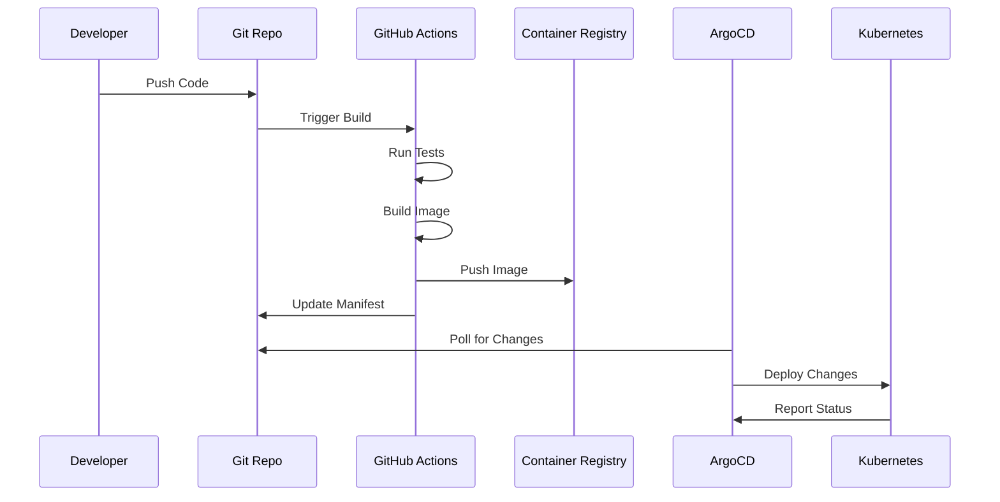

# IDP Platform Getting Started Guide

## Welcome to the IDP Platform! 🚀

This guide will help you get started with the Integrated Developer Platform (IDP) and deploy your first application.

## Prerequisites

Before you begin, ensure you have:

- **Platform Access**: AWS Cognito user account (contact platform team)
- **Local Environment**: Docker Desktop with Kubernetes enabled
- **External LocalStack**: Running at http://localhost:4566
- **Basic Knowledge**: Understanding of Kubernetes and containerization concepts
- **Git Repository**: For your application code
- **Tools**: `kubectl`, `awslocal`, and `docker` CLI tools installed

## Platform Setup (10 minutes)

### Step 0: Set Up External LocalStack

First, ensure external LocalStack is running for development:

```bash
# 1. Set up external LocalStack
./scripts/setup-external-localstack.sh

# 2. Verify LocalStack is running
curl -s http://localhost:4566/_localstack/health | jq '.services'

# 3. Test awslocal connectivity
awslocal sts get-caller-identity
```

## Quick Start (5 minutes)

### Step 1: Start the Platform

```bash
# 1. Start the entire platform
./scripts/quick-start.sh

# 2. Wait for all services to be ready (2-3 minutes)
./scripts/start-platform.sh health
```

### Step 2: Access the Developer Portal

1. Open your browser and navigate to: `http://localhost:3000`
2. Click **"Sign in with Cognito"**
3. Login with your AWS Cognito credentials:
   - **Admin User**: `admin` / `TempPassword123!`
   - **Developer User**: `developer` / `TempPassword123!`
4. You'll see the Backstage developer portal dashboard with AWS Cognito authentication

### Step 3: Create Your First Application

1. Click **"Create Component"** from the home page
2. Select **"IDP Web Application"** template
3. Fill in the required information:
   ```
   Application Name: my-first-app
   Description: My first application on IDP
   Repository: github.com/yourorg/my-first-app
   ```
4. Click **"Create"**

### Step 4: Deploy Your Application

The platform will automatically:
- Create a Git repository
- Set up CI/CD pipeline
- Deploy to development environment
- Configure monitoring and observability

### Step 5: View Your Application

1. Go to ArgoCD dashboard: `http://localhost:8080`
2. Click **"Log in via Cognito"** and use your Cognito credentials
3. Find your application in the list
4. Click to see deployment status
5. Once synced, access your app at: `http://my-first-app.idp.local`

## Detailed Tutorial

### Understanding the Platform

The IDP platform provides a comprehensive hybrid architecture with centralized authentication:

```
                    ┌─────────────────────────────────────────────────────┐
                    │                External Dependencies                │
                    │                                                     │
                    │  ┌─────────────────┐    ┌─────────────────────────┐ │
                    │  │   AWS Cognito   │    │     LocalStack           │ │
                    │  │   (Auth/OIDC)   │    │   (AWS Emulation)       │ │
                    │  │                 │    │   - S3, RDS, Secrets    │ │
                    │  └─────────────────┘    └─────────────────────────┘ │
                    └─────────────────────────────────────────────────────┘
                                    │                       │
                                    ▼                       ▼
┌─────────────────────────────────────────────────────────────────────────────┐
│                           Kubernetes Platform                               │
│                                                                             │
│  ┌─────────────────┐    ┌─────────────────┐    ┌─────────────────────────┐ │
│  │   Backstage     │    │   GitHub        │    │       ArgoCD            │ │
│  │   Portal        │───▶│   Repository    │───▶│    (GitOps CD)          │ │
│  │ 🔐 Cognito Auth │    │                 │    │   🔐 Cognito Auth       │ │
│  └─────────────────┘    └─────────────────┘    └─────────────────────────┘ │
│           │                       │                       │               │
│           ▼                       ▼                       ▼               │
│  ┌─────────────────┐    ┌─────────────────┐    ┌─────────────────────────┐ │
│  │   Service       │    │   CI Pipeline   │    │     Kubernetes          │ │
│  │   Catalog       │    │   (GitHub       │    │     Workloads           │ │
│  │                 │    │    Actions)     │    │                         │ │
│  └─────────────────┘    └─────────────────┘    └─────────────────────────┘ │
│           │                       │                       │               │
│           ▼                       ▼                       ▼               │
│  ┌─────────────────┐    ┌─────────────────┐    ┌─────────────────────────┐ │
│  │   Istio Mesh    │    │  Container      │    │     Observability       │ │
│  │  🔐 JWT Validate│    │  Registry       │    │   (Prometheus/Grafana)  │ │
│  │   + mTLS        │    │  (LocalStack)   │    │                         │ │
│  └─────────────────┘    └─────────────────┘    └─────────────────────────┘ │
└─────────────────────────────────────────────────────────────────────────────┘

🔐 = AWS Cognito Authentication     🌐 = External Service     📊 = Monitoring
```

**Key Platform Components:**

**Authentication Layer:**
- **AWS Cognito**: Centralized OAuth/OIDC authentication for all services
- **Istio JWT Validation**: Service mesh-level token verification
- **RBAC Integration**: Role-based access control with Cognito groups

**External Services:**
- **LocalStack**: AWS service emulation (development)
- **Cognito User Pool**: Authentication and user management
- **LocalStack RDS**: Database services
- **LocalStack S3**: Object storage
- **LocalStack Secrets Manager**: Secret management

**Platform Services:**
- **Backstage**: Developer portal with Cognito authentication
- **ArgoCD**: GitOps deployment with Cognito SSO
- **Istio**: Service mesh with mTLS and JWT validation
- **Monitoring**: Comprehensive observability stack

### Creating Applications

#### Using the Web Interface

1. **Navigate to Backstage**: `http://localhost:3000`

2. **Select Template**: Choose from available templates:
   - **Web Application**: Full-stack web app with database
   - **API Service**: REST API microservice
   - **Static Site**: Frontend-only application

3. **Configure Application**:
   ```yaml
   # Example configuration
   name: "user-service"
   description: "User management microservice"
   technology: "nodejs"
   database: "postgresql"
   replicas: 3
   resources:
     cpu: "500m"
     memory: "512Mi"
   ```

4. **Review Generated Code**: The platform generates:
   - Application scaffold
   - Dockerfile
   - Kubernetes manifests
   - CI/CD pipeline
   - Monitoring configuration

#### Using the CLI (Advanced)

```bash
# The IDP CLI is located in the repository root
./idp-cli create user-service nginx:latest development development 2

# Check deployment status
kubectl get webapplications -n development

# View application pods
kubectl get pods -n development -l app=user-service
```

### Working with Environments

The platform provides three environments:

#### Development Environment
- **Purpose**: Local development and testing using LocalStack
- **Authentication**: LocalStack Cognito for development
- **Database**: LocalStack RDS PostgreSQL
- **Storage**: LocalStack S3 buckets
- **Resources**: Minimal resource allocation
- **Access**: All developers with Cognito accounts

```bash
# Port forward to development
kubectl port-forward svc/my-app 8080:80 -n development

# Check LocalStack services
awslocal rds describe-db-instances
awslocal s3 ls
```

#### Staging Environment  
- **Purpose**: Pre-production testing with AWS services
- **Authentication**: AWS Cognito (staging user pool)
- **Database**: AWS RDS with sanitized data
- **Storage**: AWS S3 with test data
- **Resources**: Production-like resources
- **Access**: QA team and senior developers

```bash
# Access staging environment
kubectl get pods -n staging

# Check AWS resources (when configured)
# aws rds describe-db-instances --region us-east-1
```

#### Production Environment
- **Purpose**: Live user traffic with full AWS services
- **Authentication**: AWS Cognito (production user pool)
- **Database**: AWS RDS with automated backups
- **Storage**: AWS S3 with lifecycle policies
- **Resources**: Full production resources with auto-scaling
- **Access**: Platform team and approved personnel with MFA

### Understanding GitOps Workflow



1. **Code Changes**: Push code to Git repository
2. **CI Pipeline**: Automatically builds and tests
3. **Container Build**: Creates container image
4. **Manifest Update**: Updates Kubernetes manifests
5. **ArgoCD Sync**: Deploys to cluster
6. **Monitoring**: Observes application health

### Application Configuration

#### Environment Variables

```yaml
# In your application manifest
apiVersion: platform.idp/v1alpha1
kind: WebApplication
metadata:
  name: my-app
spec:
  appName: my-app
  image: myregistry/my-app:latest
  environment:
    - name: DATABASE_URL
      valueFrom:
        secretKeyRef:
          name: db-credentials
          key: url
    - name: API_KEY
      valueFrom:
        secretKeyRef:
          name: api-secrets
          key: key
  resources:
    requests:
      cpu: 100m
      memory: 128Mi
    limits:
      cpu: 500m
      memory: 512Mi
```

#### Secrets Management

```bash
# Secrets are managed automatically via External Secrets Operator
# For development: LocalStack Secrets Manager
awslocal secretsmanager list-secrets

# For production: AWS Secrets Manager  
# aws secretsmanager list-secrets --region us-east-1

# View secrets in cluster
kubectl get secrets -n development
kubectl get secrets -n production

# Check External Secret status
kubectl get externalsecrets --all-namespaces

# Cognito client secrets are automatically synchronized
kubectl get secret cognito-clients -n argocd -o yaml
kubectl get secret cognito-clients -n backstage -o yaml
```

#### Database Configuration

```yaml
# Database will be automatically provisioned via Crossplane
# Development: LocalStack RDS
# Production: AWS RDS
apiVersion: platform.idp/v1alpha1
kind: WebApplication
spec:
  database:
    type: postgresql
    version: "13"
    storage: "20Gi"
    backup:
      enabled: true
      schedule: "0 2 * * *"
    # Automatically uses LocalStack in development
    # and AWS RDS in production
```

### Monitoring Your Application

#### Accessing Monitoring Dashboards

1. **Platform Overview**: `http://monitoring.idp.local`
2. **Grafana Dashboards**: `http://localhost:3001`
3. **Prometheus Metrics**: `http://localhost:9090`
4. **Jaeger Tracing**: `http://localhost:16686`
5. **Kiali Service Mesh**: `http://localhost:20001`

#### Application Metrics

Your application automatically gets:

```bash
# HTTP request metrics
http_requests_total{method="GET", status="200"}

# Response time metrics
http_request_duration_seconds{quantile="0.95"}

# Error rate metrics
http_requests_total{status=~"4..|5.."}

# Custom business metrics
business_metric_users_created_total
```

#### Setting Up Custom Alerts

```yaml
# Create custom alert rules
apiVersion: v1
kind: ConfigMap
metadata:
  name: my-app-alerts
  namespace: production
data:
  alerts.yml: |
    groups:
    - name: my-app
      rules:
      - alert: HighErrorRate
        expr: rate(http_requests_total{status=~"5.."}[5m]) > 0.1
        for: 2m
        labels:
          severity: critical
        annotations:
          summary: "High error rate in my-app"
```

### Authentication Troubleshooting

#### Cannot Login to ArgoCD/Backstage

```bash
# Check Cognito user pool
awslocal cognito-idp list-users --user-pool-id <pool-id>

# Check OIDC configuration
kubectl get configmap argocd-cm -n argocd -o yaml | grep -A 10 oidc

# Test JWKS endpoint
curl -s http://localhost.localstack.cloud:4566/<pool-id>/.well-known/jwks.json | jq

# Check Istio JWT validation
kubectl get requestauthentication -n istio-system
```

#### LocalStack Connectivity Issues

```bash
# Check LocalStack health
curl -s http://localhost:4566/_localstack/health | jq

# Test from within cluster
kubectl run test --image=curlimages/curl --rm -it --restart=Never -- \
  curl -s http://host.docker.internal:4566/_localstack/health

# Check external service configuration
kubectl get service localhost-localstack-cloud -n default
kubectl get endpoints localstack-external -n default
```

### Troubleshooting Common Issues

#### Application Won't Start

```bash
# Check pod status
kubectl get pods -n <namespace> -l app=my-app

# Check pod logs
kubectl logs -n <namespace> -l app=my-app

# Check events
kubectl get events -n <namespace> --field-selector involvedObject.name=my-app
```

#### Database Connection Issues

```bash
# Check database pod
kubectl get pods -n <namespace> -l app=postgresql

# Test database connectivity
kubectl exec -n <namespace> deploy/my-app -- nc -zv postgresql 5432

# Check database logs
kubectl logs -n <namespace> -l app=postgresql
```

#### Service Mesh Issues

```bash
# Check Istio proxy status
istioctl proxy-status

# Check service mesh configuration
istioctl analyze -n <namespace>

# View Envoy configuration
istioctl proxy-config cluster my-app-pod
```

## Advanced Features

### Auto-scaling

```yaml
# Horizontal Pod Autoscaler is automatically configured
apiVersion: platform.idp/v1alpha1
kind: WebApplication
spec:
  scaling:
    minReplicas: 2
    maxReplicas: 10
    targetCPUUtilization: 70
    targetMemoryUtilization: 80
```

### Blue-Green Deployments

```bash
# Deploy to staging slot
idp deploy my-app --env production --slot staging

# Validate deployment
idp validate my-app --env production --slot staging

# Promote to production
idp promote my-app --env production --from staging
```

### Feature Flags

```yaml
# Configure feature flags
apiVersion: platform.idp/v1alpha1
kind: WebApplication
spec:
  featureFlags:
    - name: new-ui
      enabled: false
      rollout: 10  # 10% of users
    - name: beta-features  
      enabled: true
      users: ["beta-users-group"]
```

## Best Practices

### Code Organization

```
my-app/
├── src/                 # Application source code
├── tests/              # Test files
├── .github/
│   └── workflows/      # CI/CD workflows
├── k8s/
│   ├── base/          # Base Kubernetes manifests
│   └── overlays/      # Environment-specific configs
├── Dockerfile         # Container definition
└── README.md         # Documentation
```

### Security

1. **Never commit secrets** to Git repositories
2. **Use least privilege** access controls  
3. **Enable security scanning** in CI pipeline
4. **Keep dependencies updated** regularly
5. **Use network policies** to restrict traffic

### Performance

1. **Set appropriate resource limits**
2. **Use readiness and liveness probes**
3. **Implement proper logging levels**
4. **Monitor application metrics**
5. **Use caching where appropriate**

### Reliability

1. **Implement circuit breakers** for external calls
2. **Use retries with exponential backoff**
3. **Design for graceful degradation**
4. **Test failure scenarios**
5. **Monitor error rates and SLAs**

## Platform Management

### Quick Commands

```bash
# Start platform
./scripts/quick-start.sh

# Check platform health
./scripts/start-platform.sh health

# Stop platform
./scripts/start-platform.sh stop

# Restart platform
./scripts/start-platform.sh start

# Platform status
./scripts/start-platform.sh status

# View service logs
./scripts/start-platform.sh logs argocd
```

### Platform Uninstall

```bash
# Preview what will be removed
./scripts/uninstall-idp.sh --dry-run

# Complete platform removal
./scripts/uninstall-idp.sh --yes

# Note: External LocalStack and system tools are preserved
```

## Getting Help

### Documentation
- **Platform Architecture**: `/docs/architecture/platform-overview.md`
- **Operations Runbook**: `/docs/runbooks/platform-operations.md`
- **Monitoring Guide**: `/docs/tutorials/monitoring-observability.md`

### Support Channels
- **Slack**: #platform-support
- **Email**: platform-team@company.com
- **Office Hours**: Tuesdays 2-3 PM
- **GitHub Issues**: Platform bug reports and feature requests

### Self-Service Resources
- **Service Catalog**: Browse available services in Backstage
- **Templates**: Pre-built application templates with Cognito auth
- **Monitoring**: Real-time platform status with Grafana
- **ArgoCD**: GitOps deployment status with Cognito SSO

## Next Steps

Once you're comfortable with the basics:

1. **Explore Advanced Features**: Learn about advanced deployment strategies
2. **Customize Monitoring**: Set up custom dashboards and alerts
3. **Security Deep Dive**: Understand security best practices
4. **Performance Optimization**: Learn to optimize your applications
5. **Contributing**: Help improve the platform for everyone

### Advanced Tutorials
- [Monitoring and Observability Guide](./monitoring-observability.md)
- [Container Builds and CI/CD](./container-builds-guide.md)
- [ArgoCD Workflows](./argo-workflows-ci-cd.md)
- [Deploying Applications](./deploying-applications.md)
- [Platform Operations Runbook](../runbooks/platform-operations.md)

### External Dependencies
- **LocalStack**: Required for development environment
- **AWS Cognito**: Authentication and authorization
- **Docker Desktop**: Kubernetes runtime
- **External Services**: Properly configured service discovery

Happy coding! 🎉