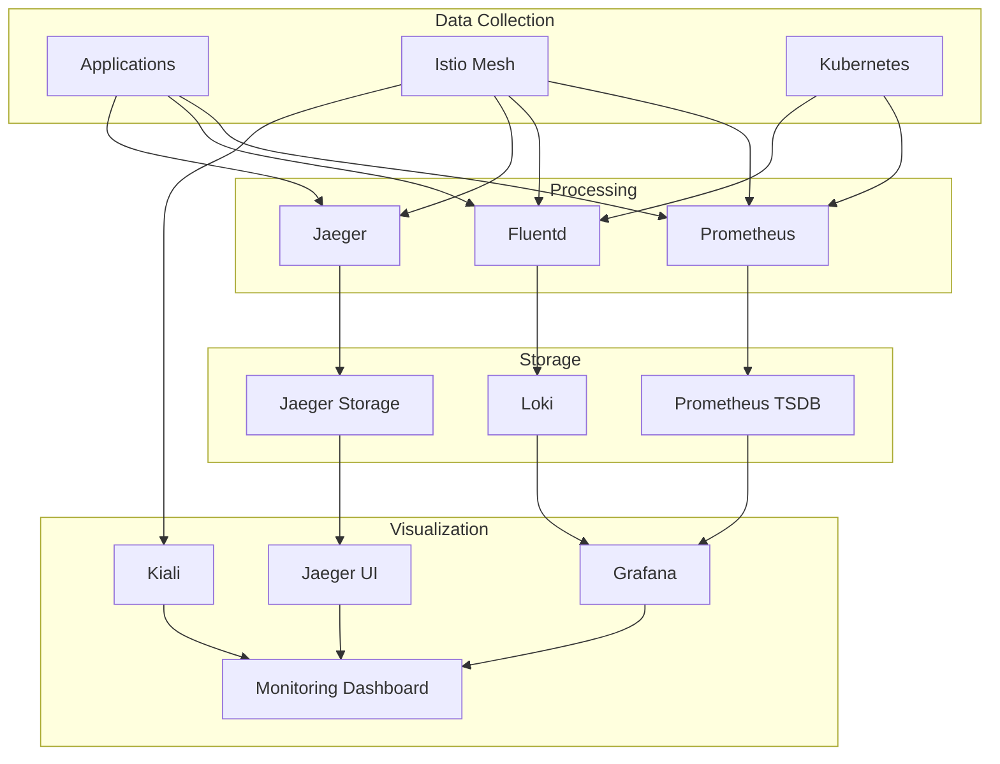

# Monitoring and Observability on IDP Platform

## Overview

This tutorial provides comprehensive guidance on monitoring and observability for applications deployed on the IDP platform. Learn how to effectively monitor your applications, set up alerts, and troubleshoot issues using the platform's observability stack.

## Table of Contents

1. [Observability Stack Overview](#observability-stack-overview)
2. [Application Metrics](#application-metrics)
3. [Logging](#logging)
4. [Distributed Tracing](#distributed-tracing)
5. [Dashboards and Visualization](#dashboards-and-visualization)
6. [Alerting](#alerting)
7. [Service Mesh Observability](#service-mesh-observability)
8. [Troubleshooting with Observability](#troubleshooting-with-observability)

## Observability Stack Overview

The IDP platform provides a comprehensive observability stack:



### Access Points

- **Monitoring Dashboard**: `http://monitoring.idp.local`
- **Grafana**: `http://localhost:3001`
- **Prometheus**: `http://localhost:9090`
- **Jaeger**: `http://localhost:16686`
- **Kiali**: `http://localhost:20001`
- **Alertmanager**: `http://alertmanager.idp.local`

## Application Metrics

### Instrumenting Your Application

#### Node.js Example

```javascript
// metrics.js
const client = require('prom-client');

// Create a Registry to register the metrics
const register = new client.Registry();

// Add default metrics
client.collectDefaultMetrics({
  app: 'user-service',
  prefix: 'nodejs_',
  timeout: 10000,
  gcDurationBuckets: [0.001, 0.01, 0.1, 1, 2, 5],
  register
});

// Custom metrics
const httpRequestsTotal = new client.Counter({
  name: 'http_requests_total',
  help: 'Total number of HTTP requests',
  labelNames: ['method', 'route', 'status_code'],
  registers: [register]
});

const httpRequestDuration = new client.Histogram({
  name: 'http_request_duration_seconds',
  help: 'Duration of HTTP requests in seconds',
  labelNames: ['method', 'route'],
  buckets: [0.1, 0.3, 0.5, 0.7, 1, 3, 5, 7, 10],
  registers: [register]
});

const activeConnections = new client.Gauge({
  name: 'active_connections',
  help: 'Number of active connections',
  registers: [register]
});

// Business metrics
const usersCreatedTotal = new client.Counter({
  name: 'users_created_total',
  help: 'Total number of users created',
  labelNames: ['source'],
  registers: [register]
});

// Middleware for Express.js
function metricsMiddleware(req, res, next) {
  const start = Date.now();
  
  res.on('finish', () => {
    const duration = (Date.now() - start) / 1000;
    
    httpRequestsTotal
      .labels(req.method, req.route?.path || req.path, res.statusCode)
      .inc();
    
    httpRequestDuration
      .labels(req.method, req.route?.path || req.path)
      .observe(duration);
  });
  
  next();
}

// Metrics endpoint
function metricsEndpoint(req, res) {
  res.set('Content-Type', register.contentType);
  res.end(register.metrics());
}

module.exports = {
  register,
  httpRequestsTotal,
  httpRequestDuration,
  activeConnections,
  usersCreatedTotal,
  metricsMiddleware,
  metricsEndpoint
};
```

```javascript
// app.js
const express = require('express');
const { metricsMiddleware, metricsEndpoint, usersCreatedTotal } = require('./metrics');

const app = express();

// Apply metrics middleware
app.use(metricsMiddleware);

// Routes
app.get('/health', (req, res) => {
  res.json({ status: 'healthy', timestamp: new Date().toISOString() });
});

app.get('/metrics', metricsEndpoint);

app.post('/users', (req, res) => {
  // Create user logic here
  
  // Record business metric
  usersCreatedTotal.labels('api').inc();
  
  res.json({ id: 123, username: 'newuser' });
});

app.listen(3000, () => {
  console.log('Server running on port 3000');
});
```

#### Python/Flask Example

```python
# metrics.py
from prometheus_client import Counter, Histogram, Gauge, generate_latest
from flask import Flask, request, jsonify
import time

app = Flask(__name__)

# Metrics
REQUEST_COUNT = Counter(
    'http_requests_total',
    'Total HTTP requests',
    ['method', 'endpoint', 'status']
)

REQUEST_LATENCY = Histogram(
    'http_request_duration_seconds',
    'HTTP request latency',
    ['method', 'endpoint']
)

ACTIVE_USERS = Gauge(
    'active_users',
    'Number of active users'
)

USERS_CREATED = Counter(
    'users_created_total',
    'Total users created',
    ['source']
)

# Middleware
@app.before_request
def before_request():
    request.start_time = time.time()

@app.after_request
def after_request(response):
    request_latency = time.time() - request.start_time
    
    REQUEST_COUNT.labels(
        method=request.method,
        endpoint=request.endpoint or 'unknown',
        status=response.status_code
    ).inc()
    
    REQUEST_LATENCY.labels(
        method=request.method,
        endpoint=request.endpoint or 'unknown'
    ).observe(request_latency)
    
    return response

# Routes
@app.route('/health')
def health():
    return jsonify({'status': 'healthy'})

@app.route('/metrics')
def metrics():
    return generate_latest()

@app.route('/users', methods=['POST'])
def create_user():
    # User creation logic
    USERS_CREATED.labels(source='api').inc()
    return jsonify({'id': 123, 'username': 'newuser'})

if __name__ == '__main__':
    app.run(host='0.0.0.0', port=3000)
```

### WebApplication Metrics Configuration

```yaml
# Configure automatic metrics collection
apiVersion: platform.idp/v1alpha1
kind: WebApplication
metadata:
  name: user-service
  namespace: production
spec:
  monitoring:
    enabled: true
    
    # Prometheus configuration
    prometheus:
      path: /metrics
      port: 3000
      interval: 30s
      scrapeTimeout: 10s
    
    # ServiceMonitor labels
    serviceMonitor:
      labels:
        app: user-service
        team: backend
    
    # Additional metric annotations
    annotations:
      prometheus.io/scrape: "true"
      prometheus.io/path: "/metrics"
      prometheus.io/port: "3000"
```

### Standard Metrics to Collect

#### RED Metrics (Request, Error, Duration)

```yaml
# Request Rate
sum(rate(http_requests_total{app="user-service"}[5m]))

# Error Rate
sum(rate(http_requests_total{app="user-service",status=~"5.."}[5m])) / 
sum(rate(http_requests_total{app="user-service"}[5m]))

# Duration (Latency)
histogram_quantile(0.95, 
  sum(rate(http_request_duration_seconds_bucket{app="user-service"}[5m])) by (le)
)
```

#### USE Metrics (Utilization, Saturation, Errors)

```yaml
# CPU Utilization
rate(container_cpu_usage_seconds_total{pod=~"user-service.*"}[5m])

# Memory Utilization
container_memory_usage_bytes{pod=~"user-service.*"} / 
container_spec_memory_limit_bytes{pod=~"user-service.*"}

# Saturation (Queue Length)
http_request_queue_length{app="user-service"}
```

## Logging

### Structured Logging

#### Best Practices

```javascript
// Node.js with Winston
const winston = require('winston');

const logger = winston.createLogger({
  format: winston.format.combine(
    winston.format.timestamp(),
    winston.format.errors({ stack: true }),
    winston.format.json()
  ),
  defaultMeta: {
    service: 'user-service',
    version: process.env.APP_VERSION || '1.0.0'
  },
  transports: [
    new winston.transports.Console()
  ]
});

// Usage
logger.info('User created', {
  userId: 123,
  username: 'john.doe',
  source: 'api',
  duration: 150,
  traceId: req.headers['x-trace-id']
});

logger.error('Database connection failed', {
  error: error.message,
  stack: error.stack,
  database: 'postgresql',
  host: 'db.example.com'
});
```

```python
# Python with structlog
import structlog
import logging

# Configure structlog
structlog.configure(
    processors=[
        structlog.stdlib.filter_by_level,
        structlog.stdlib.add_logger_name,
        structlog.stdlib.add_log_level,
        structlog.stdlib.PositionalArgumentsFormatter(),
        structlog.processors.TimeStamper(fmt="iso"),
        structlog.processors.StackInfoRenderer(),
        structlog.processors.format_exc_info,
        structlog.processors.UnicodeDecoder(),
        structlog.processors.JSONRenderer()
    ],
    context_class=dict,
    logger_factory=structlog.stdlib.LoggerFactory(),
    cache_logger_on_first_use=True,
)

logger = structlog.get_logger("user-service")

# Usage
logger.info("User created", 
           user_id=123, 
           username="john.doe",
           source="api",
           duration=150)

logger.error("Database connection failed",
            error=str(e),
            database="postgresql",
            host="db.example.com")
```

### Log Levels and When to Use Them

```javascript
// ERROR: System errors, exceptions
logger.error('Failed to connect to database', { error: error.message });

// WARN: Unexpected but recoverable situations
logger.warn('API rate limit exceeded', { userId: 123, limit: 1000 });

// INFO: General application flow
logger.info('User logged in', { userId: 123, sessionId: 'abc123' });

// DEBUG: Detailed diagnostic information
logger.debug('Processing user request', { 
  userId: 123, 
  requestId: 'req-456',
  payload: sanitizedPayload 
});

// TRACE: Very detailed diagnostic information
logger.trace('Database query executed', { 
  query: 'SELECT * FROM users WHERE id = ?',
  params: [123],
  duration: 25 
});
```

### Querying Logs with LogQL

```bash
# Basic log queries in Grafana
{app="user-service"} |= "error"
{app="user-service", level="error"}
{namespace="production"} |= "database"

# Aggregations
sum(rate({app="user-service"} |= "error" [5m])) by (level)
count_over_time({app="user-service", level="error"}[1h])

# Pattern extraction
{app="user-service"} | pattern "<level> <timestamp> <message>"
{app="user-service"} | json | userId="123"

# Performance queries
{app="user-service"} | json | duration > 1000
avg_over_time({app="user-service"} | json | unwrap duration [5m])
```

## Distributed Tracing

### Setting Up Tracing

#### OpenTelemetry Setup (Node.js)

```javascript
// tracing.js
const { NodeSDK } = require('@opentelemetry/sdk-node');
const { getNodeAutoInstrumentations } = require('@opentelemetry/auto-instrumentations-node');
const { JaegerExporter } = require('@opentelemetry/exporter-jaeger');
const { Resource } = require('@opentelemetry/resources');
const { SemanticResourceAttributes } = require('@opentelemetry/semantic-conventions');

const sdk = new NodeSDK({
  resource: new Resource({
    [SemanticResourceAttributes.SERVICE_NAME]: 'user-service',
    [SemanticResourceAttributes.SERVICE_VERSION]: process.env.APP_VERSION || '1.0.0',
    [SemanticResourceAttributes.DEPLOYMENT_ENVIRONMENT]: process.env.NODE_ENV || 'development',
  }),
  traceExporter: new JaegerExporter({
    endpoint: 'http://jaeger-collector.istio-system:14268/api/traces',
  }),
  instrumentations: [getNodeAutoInstrumentations()],
});

sdk.start();

// Custom instrumentation
const { trace } = require('@opentelemetry/api');

const tracer = trace.getTracer('user-service', '1.0.0');

async function createUser(userData) {
  return tracer.startActiveSpan('create-user', async (span) => {
    try {
      span.setAttributes({
        'user.id': userData.id,
        'user.email': userData.email,
        'operation.type': 'create'
      });
      
      // Simulate database operation
      const user = await database.users.create(userData);
      
      span.setStatus({ code: trace.SpanStatusCode.OK });
      return user;
    } catch (error) {
      span.setStatus({
        code: trace.SpanStatusCode.ERROR,
        message: error.message
      });
      span.recordException(error);
      throw error;
    } finally {
      span.end();
    }
  });
}
```

#### Python OpenTelemetry Setup

```python
# tracing.py
from opentelemetry import trace
from opentelemetry.sdk.trace import TracerProvider
from opentelemetry.sdk.trace.export import BatchSpanProcessor
from opentelemetry.exporter.jaeger.thrift import JaegerExporter
from opentelemetry.sdk.resources import Resource
from opentelemetry.instrumentation.flask import FlaskInstrumentor
from opentelemetry.instrumentation.sqlalchemy import SQLAlchemyInstrumentor

# Configure tracing
resource = Resource.create({
    "service.name": "user-service",
    "service.version": "1.0.0",
    "deployment.environment": "production"
})

trace.set_tracer_provider(TracerProvider(resource=resource))

jaeger_exporter = JaegerExporter(
    agent_host_name="jaeger-collector.istio-system",
    agent_port=14268,
)

span_processor = BatchSpanProcessor(jaeger_exporter)
trace.get_tracer_provider().add_span_processor(span_processor)

# Auto-instrument Flask and SQLAlchemy
FlaskInstrumentor().instrument_app(app)
SQLAlchemyInstrumentor().instrument(engine=db.engine)

# Custom spans
tracer = trace.get_tracer(__name__)

def create_user(user_data):
    with tracer.start_as_current_span("create-user") as span:
        span.set_attribute("user.email", user_data["email"])
        span.set_attribute("operation.type", "create")
        
        try:
            user = User(**user_data)
            db.session.add(user)
            db.session.commit()
            
            span.set_status(trace.Status(trace.StatusCode.OK))
            return user
        except Exception as e:
            span.set_status(trace.Status(
                trace.StatusCode.ERROR, 
                str(e)
            ))
            span.record_exception(e)
            raise
```

### Trace Analysis

#### Finding Performance Bottlenecks

```bash
# Jaeger UI queries
service:"user-service" operation:"create-user" duration:>1s
service:"user-service" tag:"error=true"
service:"user-service" AND service:"payment-service" duration:>2s

# Common trace patterns to look for
1. Long database queries (>100ms)
2. External API calls without timeouts
3. N+1 query problems
4. Inefficient serialization
5. Memory allocation issues
```

#### Correlating Traces with Logs

```javascript
// Add trace ID to logs
const { trace } = require('@opentelemetry/api');

function logWithTrace(message, data = {}) {
  const span = trace.getActiveSpan();
  const traceId = span?.spanContext()?.traceId;
  
  logger.info(message, {
    ...data,
    traceId: traceId
  });
}

// Usage
logWithTrace('User created successfully', { userId: 123 });
```

## Dashboards and Visualization

### Creating Custom Grafana Dashboards

#### Application Overview Dashboard

```json
{
  "dashboard": {
    "id": null,
    "title": "User Service - Application Overview",
    "tags": ["user-service", "application"],
    "style": "dark",
    "timezone": "browser",
    "panels": [
      {
        "id": 1,
        "title": "Request Rate",
        "type": "stat",
        "targets": [
          {
            "expr": "sum(rate(http_requests_total{app=\"user-service\"}[5m]))",
            "refId": "A"
          }
        ],
        "fieldConfig": {
          "defaults": {
            "unit": "reqps",
            "color": {
              "mode": "thresholds"
            },
            "thresholds": {
              "steps": [
                {"color": "green", "value": null},
                {"color": "yellow", "value": 100},
                {"color": "red", "value": 1000}
              ]
            }
          }
        },
        "gridPos": {"h": 8, "w": 6, "x": 0, "y": 0}
      },
      {
        "id": 2,
        "title": "Error Rate",
        "type": "stat",
        "targets": [
          {
            "expr": "sum(rate(http_requests_total{app=\"user-service\",status=~\"5..\"}[5m])) / sum(rate(http_requests_total{app=\"user-service\"}[5m])) * 100",
            "refId": "A"
          }
        ],
        "fieldConfig": {
          "defaults": {
            "unit": "percent",
            "color": {
              "mode": "thresholds"
            },
            "thresholds": {
              "steps": [
                {"color": "green", "value": null},
                {"color": "yellow", "value": 1},
                {"color": "red", "value": 5}
              ]
            }
          }
        },
        "gridPos": {"h": 8, "w": 6, "x": 6, "y": 0}
      },
      {
        "id": 3,
        "title": "Response Time (P95)",
        "type": "stat",
        "targets": [
          {
            "expr": "histogram_quantile(0.95, sum(rate(http_request_duration_seconds_bucket{app=\"user-service\"}[5m])) by (le))",
            "refId": "A"
          }
        ],
        "fieldConfig": {
          "defaults": {
            "unit": "s",
            "color": {
              "mode": "thresholds"
            },
            "thresholds": {
              "steps": [
                {"color": "green", "value": null},
                {"color": "yellow", "value": 0.5},
                {"color": "red", "value": 1}
              ]
            }
          }
        },
        "gridPos": {"h": 8, "w": 6, "x": 12, "y": 0}
      },
      {
        "id": 4,
        "title": "Active Pods",
        "type": "stat",
        "targets": [
          {
            "expr": "count(up{job=\"kubernetes-pods\", app=\"user-service\"} == 1)",
            "refId": "A"
          }
        ],
        "gridPos": {"h": 8, "w": 6, "x": 18, "y": 0}
      },
      {
        "id": 5,
        "title": "Request Rate Over Time",
        "type": "graph",
        "targets": [
          {
            "expr": "sum(rate(http_requests_total{app=\"user-service\"}[5m])) by (method)",
            "legendFormat": "{{method}}",
            "refId": "A"
          }
        ],
        "gridPos": {"h": 8, "w": 12, "x": 0, "y": 8}
      },
      {
        "id": 6,
        "title": "Response Time Percentiles",
        "type": "graph",
        "targets": [
          {
            "expr": "histogram_quantile(0.50, sum(rate(http_request_duration_seconds_bucket{app=\"user-service\"}[5m])) by (le))",
            "legendFormat": "P50",
            "refId": "A"
          },
          {
            "expr": "histogram_quantile(0.95, sum(rate(http_request_duration_seconds_bucket{app=\"user-service\"}[5m])) by (le))",
            "legendFormat": "P95",
            "refId": "B"
          },
          {
            "expr": "histogram_quantile(0.99, sum(rate(http_request_duration_seconds_bucket{app=\"user-service\"}[5m])) by (le))",
            "legendFormat": "P99",
            "refId": "C"
          }
        ],
        "gridPos": {"h": 8, "w": 12, "x": 12, "y": 8}
      }
    ],
    "time": {
      "from": "now-1h",
      "to": "now"
    },
    "refresh": "30s"
  }
}
```

#### Business Metrics Dashboard

```json
{
  "dashboard": {
    "title": "User Service - Business Metrics",
    "panels": [
      {
        "title": "Users Created (Rate)",
        "type": "graph",
        "targets": [
          {
            "expr": "sum(rate(users_created_total{app=\"user-service\"}[5m])) by (source)",
            "legendFormat": "{{source}}"
          }
        ]
      },
      {
        "title": "Active Users",
        "type": "stat",
        "targets": [
          {
            "expr": "active_users{app=\"user-service\"}"
          }
        ]
      },
      {
        "title": "User Registration Funnel",
        "type": "table",
        "targets": [
          {
            "expr": "sum(rate(registration_started_total[5m]))",
            "format": "table",
            "legendFormat": "Started"
          },
          {
            "expr": "sum(rate(registration_completed_total[5m]))",
            "format": "table", 
            "legendFormat": "Completed"
          }
        ]
      }
    ]
  }
}
```

### Dashboard Best Practices

1. **Use Consistent Time Ranges**: Align all panels to the same time range
2. **Color Coding**: Use green/yellow/red for status indicators
3. **Meaningful Legends**: Use clear, descriptive legend names
4. **Appropriate Visualizations**: Choose the right chart type for your data
5. **Performance**: Avoid too many high-cardinality queries

## Alerting

### Prometheus Alert Rules

```yaml
# user-service-alerts.yaml
apiVersion: v1
kind: ConfigMap
metadata:
  name: user-service-alerts
  namespace: production
  labels:
    prometheus-rules: "true"
data:
  user-service.yml: |
    groups:
    - name: user-service
      rules:
      # SLI/SLO Alerts
      - alert: UserServiceHighErrorRate
        expr: |
          (
            sum(rate(http_requests_total{app="user-service",status=~"5.."}[5m])) /
            sum(rate(http_requests_total{app="user-service"}[5m]))
          ) * 100 > 5
        for: 2m
        labels:
          severity: critical
          service: user-service
          team: backend
        annotations:
          summary: "User Service has high error rate"
          description: "Error rate is {{ $value }}% for the last 5 minutes"
          runbook_url: "https://runbooks.company.com/user-service/high-error-rate"
      
      - alert: UserServiceHighLatency
        expr: |
          histogram_quantile(0.95,
            sum(rate(http_request_duration_seconds_bucket{app="user-service"}[5m])) by (le)
          ) > 1
        for: 5m
        labels:
          severity: warning
          service: user-service
          team: backend
        annotations:
          summary: "User Service has high latency"
          description: "95th percentile latency is {{ $value }}s"
      
      # Resource Alerts
      - alert: UserServiceHighCPU
        expr: |
          rate(container_cpu_usage_seconds_total{pod=~"user-service.*"}[5m]) > 0.8
        for: 10m
        labels:
          severity: warning
          service: user-service
        annotations:
          summary: "User Service high CPU usage"
          description: "CPU usage is {{ $value }} for pod {{ $labels.pod }}"
      
      - alert: UserServiceHighMemory
        expr: |
          (
            container_memory_usage_bytes{pod=~"user-service.*"} /
            container_spec_memory_limit_bytes{pod=~"user-service.*"}
          ) > 0.9
        for: 5m
        labels:
          severity: critical
          service: user-service
        annotations:
          summary: "User Service high memory usage"
          description: "Memory usage is {{ $value | humanizePercentage }} for pod {{ $labels.pod }}"
      
      # Business Logic Alerts
      - alert: UserServiceLowRegistrationRate
        expr: |
          sum(rate(users_created_total{app="user-service"}[1h])) < 10
        for: 30m
        labels:
          severity: warning
          service: user-service
          team: product
        annotations:
          summary: "Low user registration rate"
          description: "Only {{ $value }} users registered in the last hour"
      
      # Dependency Alerts
      - alert: UserServiceDatabaseDown
        expr: |
          up{job="postgresql", instance=~".*user-service.*"} == 0
        for: 1m
        labels:
          severity: critical
          service: user-service
        annotations:
          summary: "User Service database is down"
          description: "Database {{ $labels.instance }} is not responding"
```

### Alert Routing and Notification

```yaml
# alertmanager-config.yaml
apiVersion: v1
kind: ConfigMap
metadata:
  name: alertmanager-config
  namespace: istio-system
data:
  alertmanager.yml: |
    global:
      slack_api_url: 'YOUR_SLACK_WEBHOOK_URL'
    
    route:
      group_by: ['alertname', 'service']
      group_wait: 30s
      group_interval: 5m
      repeat_interval: 4h
      receiver: 'default'
      routes:
      # Critical alerts go to on-call
      - match:
          severity: critical
        receiver: 'oncall-team'
        routes:
        - match:
            service: user-service
          receiver: 'backend-oncall'
      
      # Warning alerts go to team channels
      - match:
          severity: warning
        receiver: 'team-alerts'
        routes:
        - match:
            team: backend
          receiver: 'backend-team'
        - match:
            team: product
          receiver: 'product-team'
    
    receivers:
    - name: 'default'
      slack_configs:
      - channel: '#platform-alerts'
        title: 'Platform Alert'
        text: '{{ range .Alerts }}{{ .Annotations.summary }}{{ end }}'
    
    - name: 'oncall-team'
      pagerduty_configs:
      - service_key: 'YOUR_PAGERDUTY_SERVICE_KEY'
        description: '{{ range .Alerts }}{{ .Annotations.summary }}{{ end }}'
      slack_configs:
      - channel: '#critical-alerts'
        title: '🚨 CRITICAL ALERT'
        text: |
          Alert: {{ range .Alerts }}{{ .Annotations.summary }}
          Service: {{ .Labels.service }}
          Description: {{ .Annotations.description }}
          Runbook: {{ .Annotations.runbook_url }}{{ end }}
    
    - name: 'backend-team'
      slack_configs:
      - channel: '#backend-alerts'
        title: 'Backend Service Alert'
        text: |
          Service: {{ range .Alerts }}{{ .Labels.service }}
          Alert: {{ .Annotations.summary }}
          Description: {{ .Annotations.description }}{{ end }}
```

## Service Mesh Observability

### Istio Metrics

#### Traffic Metrics

```bash
# Request volume
sum(rate(istio_requests_total[5m])) by (destination_service_name)

# Success rate
sum(rate(istio_requests_total{response_code!~"5.."}[5m])) by (destination_service_name) /
sum(rate(istio_requests_total[5m])) by (destination_service_name)

# P99 latency
histogram_quantile(0.99, 
  sum(rate(istio_request_duration_milliseconds_bucket[5m])) by (destination_service_name, le)
)
```

#### Security Metrics

```bash
# mTLS usage
sum(rate(istio_requests_total{source_workload!="unknown"}[5m])) by (destination_service_name)

# Policy violations
sum(rate(istio_request_total{response_code="403"}[5m])) by (destination_service_name)
```

### Kiali for Service Mesh Visualization

Access Kiali at `http://localhost:20001` to view:

1. **Service Graph**: Visual representation of service dependencies
2. **Traffic Flow**: Real-time traffic between services  
3. **Security Policies**: mTLS and authorization policies
4. **Configuration Validation**: Istio configuration issues

## Troubleshooting with Observability

### Performance Issues

#### High Latency Investigation

```bash
# 1. Check overall service latency
histogram_quantile(0.95, 
  sum(rate(http_request_duration_seconds_bucket{app="user-service"}[5m])) by (le)
)

# 2. Break down by endpoint
histogram_quantile(0.95, 
  sum(rate(http_request_duration_seconds_bucket{app="user-service"}[5m])) by (le, route)
)

# 3. Check database query times
histogram_quantile(0.95,
  sum(rate(database_query_duration_seconds_bucket{app="user-service"}[5m])) by (le, query_type)
)

# 4. Look for external service calls
http_request_duration_seconds{app="user-service", external_service!=""}
```

#### Error Rate Investigation

```bash
# 1. Overall error rate
sum(rate(http_requests_total{app="user-service",status=~"5.."}[5m])) /
sum(rate(http_requests_total{app="user-service"}[5m]))

# 2. Error rate by endpoint
sum(rate(http_requests_total{app="user-service",status=~"5.."}[5m])) by (route) /
sum(rate(http_requests_total{app="user-service"}[5m])) by (route)

# 3. Check error logs
{app="user-service", level="error"} | json | line_format "{{.timestamp}} {{.message}}"

# 4. Correlate with traces
# Use trace ID from error logs to find distributed trace
```

### Resource Issues

#### Memory Leaks

```bash
# Memory usage trend
container_memory_usage_bytes{pod=~"user-service.*"}

# Memory allocation rate  
rate(process_heap_bytes{app="user-service"}[5m])

# Garbage collection frequency
rate(nodejs_gc_duration_seconds_count{app="user-service"}[5m])
```

#### CPU Throttling

```bash
# CPU usage vs limits
rate(container_cpu_usage_seconds_total{pod=~"user-service.*"}[5m]) /
container_spec_cpu_quota{pod=~"user-service.*"} * 100

# CPU throttling
rate(container_cpu_cfs_throttled_seconds_total{pod=~"user-service.*"}[5m])
```

This comprehensive guide covers all aspects of monitoring and observability on the IDP platform. Use these techniques to maintain high visibility into your applications and quickly resolve issues when they arise.